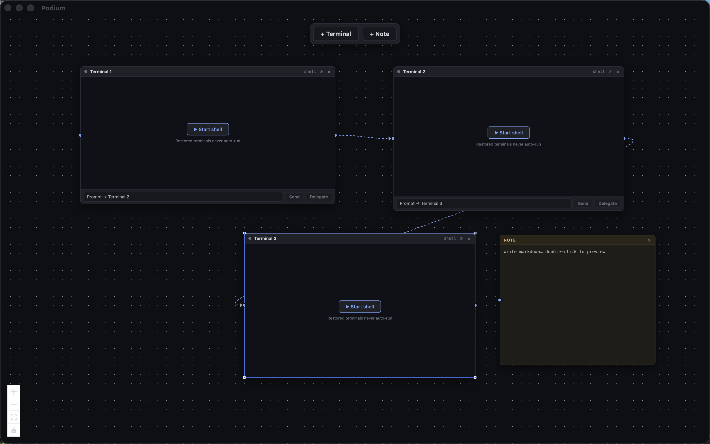

<div align="center">

# 🏁 Podium

**An infinite spatial canvas for terminal windows running AI coding agents.**

Drop Claude Code, Codex, OpenCode — or plain shells — onto a zoomable canvas, wire them together, and let agents pipe prompts into each other. Add markdown sticky notes to capture output. No built-in AI: Podium orchestrates the CLI agents *you* already have installed.



[](https://tauri.app)
[](https://react.dev)
[](https://www.typescriptlang.org)
[](https://www.rust-lang.org)
[](./LICENSE)

**English** · [Português (BR)](#-português-br)

</div>

---

## What is Podium?

Most terminal multiplexers give you tabs and splits. Podium gives you an **infinite 2D canvas**. Each terminal is a node you can drag, resize, rename, and connect. Because AI coding agents run as CLIs, you can:

- Run **many agents side by side** and watch them work in parallel.
- **Connect a terminal to another terminal** — the source agent's last output is wrapped in a handoff template and piped straight into the target agent's stdin. Agent-to-agent handoff, no copy-paste.
- **Connect a terminal to a note** to capture its output as timestamped markdown.
- Zoom out to see the whole orchestra; zoom in to drive a single agent.

It's a workspace for people who run more than one agent at a time and want to *see* the whole thing.

## Features

| | |
|---|---|
| 🖥️ **Real terminals** | Full PTY round-trip via `portable-pty` — typing, colors, resize, Ctrl+C, arrows. Launch `claude`, `codex`, `opencode`, or any shell. |
| ♾️ **Infinite canvas** | Pan, zoom, drag. Built on React Flow. Drag nodes by their header only. |
| 🔗 **Connections** | Animated arrow edges. Terminal→terminal and terminal→note. Double-click an edge to delete. |
| 🤝 **Agent-to-agent handoff** | Toggle `allowIncoming` per node. Delegate wraps the source's last output in a handoff prompt and writes it to allowed targets. |
| 📝 **Markdown notes** | Dependency-free renderer (no HTML injection). Capture → note appends the last 20 lines, timestamped. |
| 💬 **Prompt broadcast** | Footer input pipes a prompt into every connected terminal's stdin at once. |
| 💾 **Persistence** | Workspace saved as plain JSON in the app data dir. Debounced auto-save. No database. |
| 🪟 **Cross-platform** | Windows (ConPTY) + macOS (openpty). Primary target is Windows. |

## Stack

- **[Tauri 2](https://tauri.app)** (Rust backend) + **React 18** + **TypeScript** (strict) + **Vite**
- **[xterm.js](https://xtermjs.org)** (`@xterm/xterm` + fit + webgl addons)
- **`portable-pty`** — ConPTY on Windows, openpty on Unix
- **[zustand](https://zustand.docs.pmnd.rs)** for frontend state
- **[React Flow](https://reactflow.dev)** (`@xyflow/react`) for the canvas
- Persistence: plain JSON in Tauri's `app_data_dir` — no database

## Getting started

### Prerequisites

- [Node.js](https://nodejs.org) 18+
- [Rust](https://www.rust-lang.org/tools/install) (stable) + the [Tauri prerequisites](https://tauri.app/start/prerequisites/) for your OS
- At least one AI CLI agent installed if you want to drive one (e.g. [Claude Code](https://claude.com/claude-code))

### Run in development

```bash
git clone https://github.com/abrahao-dev/podium-app.git
cd podium-app
npm install
npm run tauri dev
```

### Build a release binary

```bash
npm run tauri build
```

## Usage

1. **`+ Terminal`** in the top toolbar spawns a new terminal node. Type `claude` (or any agent CLI) and hit enter.
2. **`+ Note`** drops a markdown sticky note.
3. Drag from a terminal's **right handle** to another terminal's **left handle** to connect them.
4. Use the **footer prompt** to broadcast a prompt to all connected terminals.
5. Toggle the header **⊘ / ⇥** to allow a node to receive agent-to-agent handoffs.
6. Your layout **auto-saves** — reopen and pick up where you left off. Restored terminals show a *Start* overlay and never auto-run a command.

## Project status

Podium is built in phases. Current state:

- [x] **Phase 1** — Skeleton + one working terminal (full PTY round-trip, `claude` launchable)
- [x] **Phase 2** — Multiple terminals + notes + persistence
- [x] **Phase 3** — Connections (handles, edges, prompt broadcast, capture)
- [x] **Phase 4** — Agent-to-agent handoff
- [ ] **Phase 5** — Windows pass (ConPTY quirks)

> **Note:** This is an early-stage MVP. It's the author's first open-source project — issues, ideas, and PRs are very welcome. 🙌

## Contributing

Contributions are welcome! A few ground rules that keep the codebase healthy:

- **TypeScript strict, no `any`.** `cargo clippy` must stay clean.
- **All platform-specific Rust lives in `src-tauri/src/pty.rs`** — nowhere else.
- **Windows and macOS must both work at all times.** Use Tauri path APIs; write `\r` (not `\n`) to submit input to PTYs.
- Conventional commits. Every change should keep the app launching.

Open an issue to discuss anything non-trivial before a large PR.

## License

[MIT](./LICENSE) © 2026 Matheus Abrahão

---
---

<div align="center">

# 🏁 Podium — Português (BR)

**Um canvas espacial infinito para janelas de terminal rodando agentes de IA para código.**

[English](#-podium) · **Português (BR)**

</div>

## O que é o Podium?

A maioria dos multiplexadores de terminal te dá abas e splits. O Podium te dá um **canvas 2D infinito**. Cada terminal é um nó que você pode arrastar, redimensionar, renomear e conectar. Como agentes de IA para código rodam como CLIs, você pode:

- Rodar **vários agentes lado a lado** e vê-los trabalhar em paralelo.
- **Conectar um terminal a outro terminal** — a última saída do agente de origem é embrulhada num template de handoff e enviada direto para o stdin do agente de destino. Handoff agente-para-agente, sem copiar e colar.
- **Conectar um terminal a uma nota** para capturar sua saída como markdown com data/hora.
- Dar zoom out para ver a orquestra inteira; zoom in para operar um único agente.

É um espaço de trabalho para quem roda mais de um agente ao mesmo tempo e quer *enxergar* tudo.

## Funcionalidades

| | |
|---|---|
| 🖥️ **Terminais de verdade** | PTY completo via `portable-pty` — digitação, cores, resize, Ctrl+C, setas. Rode `claude`, `codex`, `opencode` ou qualquer shell. |
| ♾️ **Canvas infinito** | Pan, zoom, arrastar. Construído com React Flow. Nós são arrastados só pelo cabeçalho. |
| 🔗 **Conexões** | Arestas animadas com seta. Terminal→terminal e terminal→nota. Duplo-clique numa aresta apaga. |
| 🤝 **Handoff agente-para-agente** | Toggle `allowIncoming` por nó. Delegar embrulha a última saída da origem num prompt de handoff e escreve nos destinos permitidos. |
| 📝 **Notas markdown** | Renderizador sem dependências (sem injeção de HTML). Capturar → a nota adiciona as últimas 20 linhas com data/hora. |
| 💬 **Broadcast de prompt** | Input do rodapé envia um prompt para o stdin de todos os terminais conectados de uma vez. |
| 💾 **Persistência** | Workspace salvo como JSON puro no diretório de dados do app. Auto-save com debounce. Sem banco de dados. |
| 🪟 **Multiplataforma** | Windows (ConPTY) + macOS (openpty). Alvo principal é Windows. |

## Stack

- **[Tauri 2](https://tauri.app)** (backend em Rust) + **React 18** + **TypeScript** (strict) + **Vite**
- **[xterm.js](https://xtermjs.org)** (`@xterm/xterm` + addons fit e webgl)
- **`portable-pty`** — ConPTY no Windows, openpty no Unix
- **[zustand](https://zustand.docs.pmnd.rs)** para estado no frontend
- **[React Flow](https://reactflow.dev)** (`@xyflow/react`) para o canvas
- Persistência: JSON puro no `app_data_dir` do Tauri — sem banco de dados

## Começando

### Pré-requisitos

- [Node.js](https://nodejs.org) 18+
- [Rust](https://www.rust-lang.org/tools/install) (stable) + os [pré-requisitos do Tauri](https://tauri.app/start/prerequisites/) para o seu SO
- Pelo menos um agente CLI de IA instalado, se quiser operar um (ex.: [Claude Code](https://claude.com/claude-code))

### Rodar em desenvolvimento

```bash
git clone https://github.com/abrahao-dev/podium-app.git
cd podium-app
npm install
npm run tauri dev
```

### Gerar binário de release

```bash
npm run tauri build
```

## Como usar

1. **`+ Terminal`** na barra superior cria um novo nó de terminal. Digite `claude` (ou qualquer CLI de agente) e dê enter.
2. **`+ Note`** cria uma nota markdown.
3. Arraste do **handle direito** de um terminal até o **handle esquerdo** de outro para conectá-los.
4. Use o **prompt do rodapé** para enviar um prompt a todos os terminais conectados.
5. Alterne o **⊘ / ⇥** no cabeçalho para permitir que um nó receba handoffs agente-para-agente.
6. Seu layout tem **auto-save** — reabra e continue de onde parou. Terminais restaurados mostram um overlay *Start* e nunca rodam um comando automaticamente.

## Status do projeto

O Podium é construído em fases. Estado atual:

- [x] **Fase 1** — Esqueleto + um terminal funcionando (PTY completo, `claude` executável)
- [x] **Fase 2** — Múltiplos terminais + notas + persistência
- [x] **Fase 3** — Conexões (handles, arestas, broadcast de prompt, captura)
- [x] **Fase 4** — Handoff agente-para-agente
- [ ] **Fase 5** — Ajustes para Windows (particularidades do ConPTY)

> **Nota:** É um MVP em estágio inicial. É o primeiro projeto open source do autor — issues, ideias e PRs são muito bem-vindos. 🙌

## Contribuindo

Contribuições são bem-vindas! Algumas regras que mantêm o código saudável:

- **TypeScript strict, sem `any`.** `cargo clippy` precisa ficar limpo.
- **Todo código Rust específico de plataforma vive em `src-tauri/src/pty.rs`** — em nenhum outro lugar.
- **Windows e macOS precisam funcionar sempre.** Use as APIs de path do Tauri; escreva `\r` (não `\n`) para submeter input a PTYs.
- Conventional commits. Toda mudança deve manter o app iniciando.

Abra uma issue para discutir algo não trivial antes de um PR grande.

## Licença

[MIT](./LICENSE) © 2026 Matheus Abrahão
